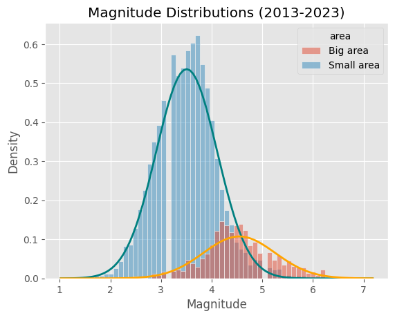
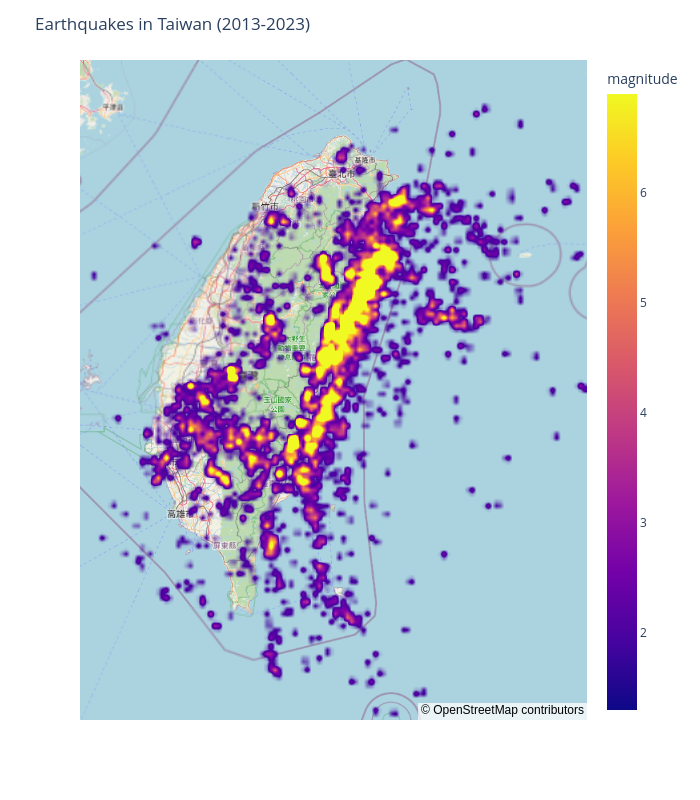
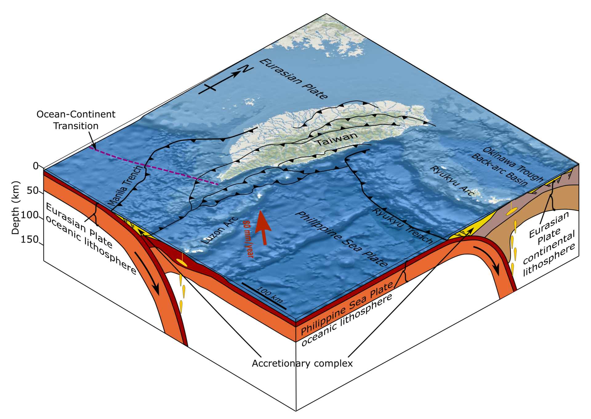
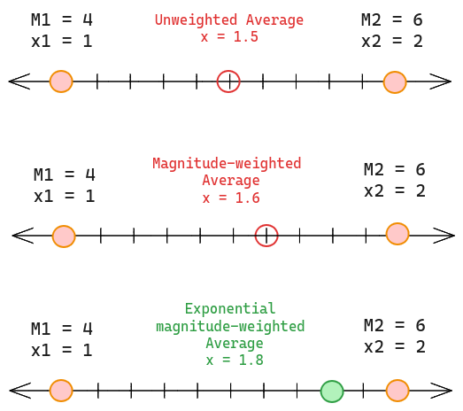

# Study of seismic activity in Taiwan (2013-2023)

## To do

- [x] Hypothesis Testing, could the drift be due to chance?
- [x] Separate the two earthquake populations in different datasets
- [ ] Organize thought flow
- [x] Train a model that is able to discern between the two earthquake populations

## Findings

- There are two distinct distributions of earthquakes.
- The drift is statistically significant
- Gutenber-Richter parameters

## 1. Overview

This notebook aims to explore possible patterns and trends present in the data gathered by the [Central Weather Administration](https://www.cwa.gov.tw/V8/E/E/index.html) in the past decade. The data is freely available for anyone interested in their website. I may put it up in Kaggle for easier access at some point in the near future.

The main finding in this notebook is the southward drift of the average seismic activity and its statistical relevance.

## 2. The Data

### 2.1 Data Dictionary

The dataset included in this repo contains more columns than the original. The source dataset contains the following features:

- `number`: Assigns a label to each earthquake. A group of observations are labelled `Small area` while the other group will have consecutive numbers (1,2,...) that reset at the end of the year. The first _big_ earthquake of every year will be #1.
- `date`: Date and time of the measurement (YYYY-MM-DD hh:mm:ss)
- `longitude_e`: Eastwards longitude
- `latitude_n`: Northwards latitude
- `magnitude`: Measured magnitude of the earthquake
- `depth`: Measured depth of the epicenter
- `location`: (latitude_n, longitude_e)
- `loc_full` and `loc_name`: Human readable location information

### 2.2 Magnitude Distribution

The first question that arose was about the criteria by which earthquakes get classified as `Small area` or not (what logically ended up being the `Big area` in this notebook). One may think that this distinction is linked to magnitude but a quick glance at the magnitude distributions shows that it isn't that clear.

It is important to mention that the magnitude of earthquakes is considered a random variable. This means that there doesn't seem to be a way of predicting the next earthquake's magnitude. On the other hand, this type of measurements are normally distributed (they follow the beautiful teal and orange curves in the graph) when aggregated.
This graph supports the claim that there are two distinct earthquake populations within the dataset, each with their own average magnitude and standard deviation.

### 2.3 Geographic Distribution

There was a saying about pictures and words... anyway:

Most of the notable earthquakes tent to happen along the East coast of the island aligning with the tectonic boundary between the Eurasian and Phillippine Sea plates.

Image by [Mikenorton](https://www.wikiwand.com/en/User:Mikenorton), distributed under [CC BY-SA 4.0 DEED](https://creativecommons.org/licenses/by-sa/4.0/deed.en) license.

## 3. Feature Engineering

This section is intended to justify the choices made when creating new features. It may be helpful when looking at the code.

### 3.1 Annual seismic center

This feature was created as a way of aggregating all the data from the same year into a single observation. Because of the disparity in sample size between small and big area earthquakes, I decided to use a weighted average. The weight is the exponential of the each earthquakes magnitude.

Let's give a simple example of this method in one spatial dimension. For this example we are going to have two earthquakes of $M_1= 4$ and $M_2 = 6$ occurring at locations $x_1 = 1$ and $x_2 = 2$. For simplicity the exponential constant is set to 2, this doesn't change the validity of the point made in this section.

